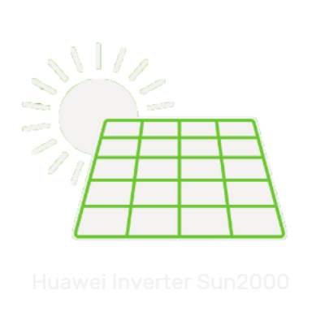

# ioBroker.sun2000

**Tests:** 

**This adapter uses Sentry libraries to automatically report exceptions and code errors to the developers.**\
For more details and for information how to disable the error reporting see [Sentry-Plugin Documentation](https://github.com/ioBroker/plugin-sentry#plugin-sentry)!\
Sentry reporting is used starting with js-controller 3.0.

## sun2000 adapter for ioBroker

Read and write register data from Huawei SUN2000 inverter and LUNA2000 battery using Modbus TCP. Third-party devices can be integrated via the modbus proxy. Even a Huawei SmartLogger can be integrated.

[Huawei product information](https://solar.huawei.com/en/professionals/all-products?residential-smart-pv)

Feel free to follow the discussions in the german [iobroker forum](https://forum.iobroker.net/topic/71768/test-adapter-sun2000-v0-1-x-huawei-wechselrichter)

## Dependencies
* Node.js 18.x or higher
* ioBroker host (js-controller) 5.0.19 or higher
* ioBroker admin 5.1.13 or higher

## Documentation

See the [documentation page](https://github.com/bolliy/ioBroker.sun2000/blob/main/docs/README.md) or 
browse in the [wiki](https://github.com/bolliy/ioBroker.sun2000/wiki)

## Supported hardware

* HUAWEI Inverter SUN2000 Serie (M0,M1,M2 and higher) 
* HUAWEI Smart Dongle-WLAN-FE / min. Softwareversion: V100R001C00SPC133 (SDongleA-05)
* HUAWEI Luna2000 Battery
* HUAWEI Smart Power Sensor DTSU666-H or DDSU666-H
* HUAWEI Smart Logger / min. Softwareversion: V300R023C10SPC311

## Feature list

* Maximum `5 inverters` (master/slave) can be processed, each with a battery module (max. 15kWh).
* `Real-time` values such as input power, output power, charging/discharging power and the grid consumption are read out at a fixed interval. 
* States are only written for changed data from the inverter. This relieves the burden on the iobroker instance.
* The states “inputPower” or “activePower” in the “collected” path can be monitored with a “was updated” trigger element. Because these states are always written within the set interval.
* [`Battery charge control`](https://github.com/bolliy/ioBroker.sun2000/wiki/Battery-control): The battery charging mode of Huawei LUNA2000 batteries can be controlled. Here you can activate and deactivate the battery charging mode to "charging from grid”. In addition, the charging capacity and charging power can be adjusted.
* [`Force charge discharge battery`](https://github.com/bolliy/ioBroker.sun2000/wiki/Erzwungenes-Laden-und-Entladen-der-Batterie-(Force-charge-discharge-battery)): Forced charge/discharge is usually used to test the battery connected to an inverter. Normally it is not recommended to perform forced charging/discharging. 
* [`Export Control`](https://github.com/bolliy/ioBroker.sun2000/wiki/Begrenzung-Netzeinspeisung-(Export-Control)): The excess PV energy is fed into the power grid, but not all countries allow users to sell electricity. Some countries have introduced regulations to restrict the sale of electricity to the grid. 
* [`modbus-proxy`](https://github.com/bolliy/ioBroker.sun2000/wiki/Modbus-Proxy): Third party device such as wallbox, energy manager etc. can receive data even if the modbus interface of inverter is already in use. In addition you can mirror the sun2000 data to another IoBroker instance.
* Huawei [`SmartLogger`](https://github.com/bolliy/ioBroker.sun2000/wiki/SmartLogger) integration: Monitors and manages the PV power system. The adapter saves the collected data in the same way as it does when read out the inverter directly.

## Changelog

<!--
	Placeholder for the next version (at the beginning of the line):
	### **WORK IN PROGRESS**
-->
### **WORK IN PROGRESS**
* Emma Integration

### 0.12.1 (2024-09-29)
* no warning from check the valid number during standby: "no irradiation"

### 0.12.0 (2024-09-23)
* Requirements from ioBroker Check and Service Bot #104
* added battery packs #85
* added config panel `Further Register`

### 0.11.0 (2024-06-27)
* added a donation link in the adapter settings
* dependency updated

### 0.10.0 (2024-06-14)
* dependency and configuration updates
* adjust roles in the control path
* Battery control: add backup power SOC #84
* fix: wrong state name `control.battery.targetSOC` with trailing space

### 0.9.0 (2024-05-09)
* dependency and configuration updates
* modbus device remains active in standby on the inverter M2,M3

### 0.8.0 (2024-04-19)
* Check numerical values for plausibility #75
* realization the "limit the power fed to grid" (Export control)
* realization the "forcible Charge or Discharge Power"
* If the error 'ECONNRESET' appear, the modbus proxy should not terminate

### 0.7.1 (2024-04-09)
* inverter model name too many characters #73

### 0.7.0 (2024-04-03)
* breaking changes
	- Node.js 18.x or higher required
	- ioBroker host (js-controller) 5.x or higher

### 0.6.2 (2024-03-31)
* standby detection adjusted
* improvement of logs

### 0.6.1 (2024-03-23)
* Battery control: After the second failed attempt, the control event is discarded
* Battery control: Adjust the battery maxCharge and Discharge to the actual values

### 0.6.0 (2024-03-21)
* realization the "battery charge control" #61
* fix the standby detection #60

### 0.5.1 (2024-03-11)
* config page restructured
* read only the required string data
* fix interval medium

### 0.5.0 (2024-03-07)
* Integration of [Huawei SmartLogger](https://support.huawei.com/enterprise/de/doc/EDOC1100130069/d8a00460)
* some meter states the unit was changed (for example sun2000.0.meter.activePowerL1) (#56)
* sun2000 serie M2 or higher can also be processed

### 0.4.1 (2024-03-03)
* read PV string data slower (medium interval)

### 0.4.0 (2024-03-01)
* detect standby mode of inverters (#34)
* devices in standby often give incorrect values. These are assigned "0" (#40)
* the modbus register and the length are stored in the description of the states
* implemented modbus-proxy (read-only cache)
* read register data from SDongleA 
* additional loop interval medium (SDongle data)
* Integration of [NRGkick Wallbox](https://www.nrgkick.com)
* read string data faster (high interval)

### 0.3.1 (2024-02-12)
* state `sun2000.0.collected.chargeDischargePowercharge` is not always refreshed #47

### 0.3.0 (2024-02-10)
* add battery unit information for example temperature #40
* modbus timeout, connect delay and delay can be configured #34
* device status as plain text `sun2000.0.inverter.x.derived.deviceStatus`
* Introduction of a driver model. A separate driver can be created for each device #41

### 0.2.1 (2024-02-02)
* Requirements from [Add sun2000 to latest](https://github.com/ioBroker/ioBroker.repositories/pull/3219)

### 0.2.0 (2024-01-24)
* [Add sun2000 to latest](https://github.com/ioBroker/ioBroker.repositories/pull/3219)
* improve error handling (#34)
* add simple optimizer info 
* Riemann sum of input power with energy loss for new state `dailySolarYield`
* try to recreate the `yield today` from the fusion portal

### 0.1.3 (2024-01-17)
* display the data from PV strings (#27)
* optimize the timing of interval loop
* improved handling of read timeouts from more then 2 inverters

### 0.1.2 (2024-01-12)
* fix: no Data if interval less 20 sec (#24)
* prepare collected values more precisely
* expand up to 5 inverters #18
* fix: problems with multiple inverters

### 0.1.1 (2024-01-07)
* fix some collected values

### 0.1.0 (2024-01-06)
* watchdog implemented #11
* state values are cached - only changed data should be stored 
* derived and collected values for example `inputPowerEffective` or `inputYield`
* deploy more register

### 0.0.2 (2023-12-19)
Dependency and configuration updates

### 0.0.1 
initial release

## License
MIT License

Copyright (c) 2024 bolliy <stephan@mante.info>

Permission is hereby granted, free of charge, to any person obtaining a copy
of this software and associated documentation files (the "Software"), to deal
in the Software without restriction, including without limitation the rights
to use, copy, modify, merge, publish, distribute, sublicense, and/or sell
copies of the Software, and to permit persons to whom the Software is
furnished to do so, subject to the following conditions:

The above copyright notice and this permission notice shall be included in all
copies or substantial portions of the Software.

THE SOFTWARE IS PROVIDED "AS IS", WITHOUT WARRANTY OF ANY KIND, EXPRESS OR
IMPLIED, INCLUDING BUT NOT LIMITED TO THE WARRANTIES OF MERCHANTABILITY,
FITNESS FOR A PARTICULAR PURPOSE AND NONINFRINGEMENT. IN NO EVENT SHALL THE
AUTHORS OR COPYRIGHT HOLDERS BE LIABLE FOR ANY CLAIM, DAMAGES OR OTHER
LIABILITY, WHETHER IN AN ACTION OF CONTRACT, TORT OR OTHERWISE, ARISING FROM,
OUT OF OR IN CONNECTION WITH THE SOFTWARE OR THE USE OR OTHER DEALINGS IN THE
SOFTWARE.

[def]: https://github.com/bolliy/ioBroker.sun2000/wiki