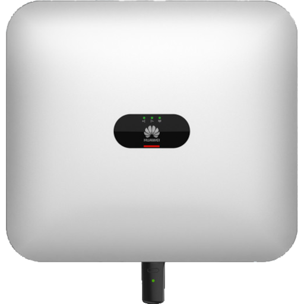

# ioBroker.sun2000

**Tests:** 

**This adapter uses Sentry libraries to automatically report exceptions and code errors to the developers.**\
For more details and for information how to disable the error reporting see [Sentry-Plugin Documentation](https://github.com/ioBroker/plugin-sentry#plugin-sentry)!\

## sun2000 adapter for ioBroker

Read and write register data from Huawei SUN2000 inverter and LUNA2000 battery using Modbus TCP. Third-party devices can access via the modbus proxy. Even a Huawei SmartLogger or an Huawei Emma can be integrated.

[Huawei product information](https://solar.huawei.com/en/professionals/all-products?residential-smart-pv)

Feel free to follow the discussions in the german [iobroker forum](https://forum.iobroker.net/topic/71768/test-adapter-sun2000-v0-1-x-huawei-wechselrichter)

## Requirements
* Node.js 22 or higher
* ioBroker host (js-controller) 6.0.11 or higher
* ioBroker admin 7.6.20 or higher

## Documentation

See the [documentation page](https://github.com/bolliy/ioBroker.sun2000/blob/main/docs/README.md) or 
browse in the [wiki](https://github.com/bolliy/ioBroker.sun2000/wiki)

## Supported hardware

* HUAWEI Inverter SUN2000 Serie (M0,M1,M2 and higher) 
* HUAWEI Smart Dongle-WLAN-FE / min. Softwareversion: V100R001C00SPC133 (SDongleA-05)
* HUAWEI Luna2000 Battery
* HUAWEI Smart Power Sensor DTSU666-H or DDSU666-H
* HUAWEI Smart Logger / min. Softwareversion: V300R023C10SPC311
* HUAWEI EMMA / min. Softwareversion: V100R024C00SPC101

## Feature list

* Maximum `5 inverters` (master/slave) can be processed, each with a battery module.
* `Real-time` values such as input power, output power, charging/discharging power and the grid consumption are read out at a fixed interval. 
* States are only written for changed data from the inverter. This relieves the burden on the iobroker instance.
* The states “inputPower” or “activePower” in the “collected” path can be monitored with a “was updated” trigger element. Because these states are always written within the set interval.
* [`Battery charge control`](https://github.com/bolliy/ioBroker.sun2000/wiki/Battery-control): The battery charging mode of Huawei LUNA2000 batteries can be controlled. Here you can activate and deactivate the battery charging mode to "charging from grid”. In addition, the charging capacity and charging power can be adjusted.
* [`Force charge discharge battery`](https://github.com/bolliy/ioBroker.sun2000/wiki/Erzwungenes-Laden-und-Entladen-der-Batterie-(Force-charge-discharge-battery)): Forced charge/discharge is usually used to test the battery connected to an inverter. Normally it is not recommended to perform forced charging/discharging. 
* [`Export Control`](https://github.com/bolliy/ioBroker.sun2000/wiki/Begrenzung-Netzeinspeisung-(Export-Control)): The excess PV energy is fed into the power grid, but not all countries allow users to sell electricity. Some countries have introduced regulations to restrict the sale of electricity to the grid. 
* [`modbus-proxy`](https://github.com/bolliy/ioBroker.sun2000/wiki/Modbus-Proxy): Third party device such as wallbox, energy manager etc. can receive data even if the modbus interface of inverter is already in use. In addition you can mirror the sun2000 data to another IoBroker instance.
* Huawei [`SmartLogger`](https://github.com/bolliy/ioBroker.sun2000/wiki/SmartLogger) integration: Monitors and manages the PV power system. The adapter saves the collected data in the same way as it does when read out the inverter directly.
* Huawei [`Emma`](https://github.com/bolliy/ioBroker.sun2000/wiki/Emma) integration: The Modbus access, network connectivity (WiFi and Ethernet) and the DDSU/DTSU-666H smart meter functions are integrated in one unit - the use of the Sdongle becomes redundant. In addition Huawei EV chargers and load shedding/control (via selected Shelly devices) are supported and "intelligent" controlled.
* Huawei [`Charger`](https://github.com/bolliy/ioBroker.sun2000/issues/171) via Emma integration: The chargers are automatically recognized and the data is saved in their own path. 
* [`Statistics`](https://github.com/bolliy/ioBroker.sun2000/wiki/Statistk-(statistics)): Aggregates historical collected datapoints into time-based summaries (e.g. hourly, daily, monthly, yearly).
These statistics should be able to be visualized in ioBroker VIS using the flexcharts adapter to create interactive diagrams for inverter performance and energy production.
* [`Surplus Power Control`](https://github.com/bolliy/ioBroker.sun2000/wiki/%C3%9Cberschuss-(surplus))
The sun2000 adapter calculates how much of your self-generated solar energy is available to power devices in your home — instead of sending it to the grid.

## Changelog
<!--
	Placeholder for the next version (at the beginning of the line):
	### **WORK IN PROGRESS**
-->
### **WORK IN PROGRESS**
* statistics: added live power chart (statistics.jsonLive)

### 2.4.5 (2026-05-14)
* statistics fix: return weekly range up to current Monday
* statistics: added support for generating statistics templates directly from built-in charts
* statistics: improved tooltip formatter - tooltip units are now provided explicitly via tooltip.valueFormatter

### 2.4.4 (2026-05-04)
* statistics fix: add error handling for waitForValue function

### 2.4.3 (2026-04-19)
* statistics: new state `statistics.jsonToday` — live summary of today's energy values
* statistics: default chart shows energy flows above/below zero line, SOC (hourly only), self-sufficiency and self-consumption on second Y-axis
* statistics: computed values `selfSufficiency` and `selfConsumption` calculated automatically in all time-series states
* statistics: data placeholders (`%%solarYield%%`, `%%selfSufficiency%%` etc.) and negated variants (`%%gridExportNeg%%` etc.) for mirrored chart layouts

### 2.4.2 (2026-04-04)
* fix test-and-release: deploy with 24.x
* statistics: flexcharts integration — built-in Apache ECharts configuration with bar and line chart support
* statistics: day-break visualization with alternating shaded areas for hourly charts
* statistics: per chart-type templates (`statistics.flexCharts.template.hourly` etc.) for full ECharts customization including functions
* statistics: data placeholders (`%%solarYield%%`, `%%gridExport%%` etc.) allow complete chart layout control via template states
* statistics: chart output states (`statistics.flexCharts.jsonOutput.hourly` etc.) updated automatically each hour

### 2.4.0 (2026-03-14)
* fix: the order of bit assignment corrected of alarmsJSON
* new state `inverter.x.emma.activeAlarmSN` and `inverter.x.emma.HistoricalAlarmSN` : emma alarms  [#226](https://github.com/bolliy/ioBroker.sun2000/issues/226)
* statistics: Aggregates historical collected datapoints into time-based summaries (e.g. hourly, daily, monthly, yearly). The data is stored in the path `statistics` as JSON.

[Older changelogs can be found there](CHANGELOG_OLD.md)

## License
MIT License

Copyright (c) 2025-2026 bolliy <stephan@mante.info>

Permission is hereby granted, free of charge, to any person obtaining a copy
of this software and associated documentation files (the "Software"), to deal
in the Software without restriction, including without limitation the rights
to use, copy, modify, merge, publish, distribute, sublicense, and/or sell
copies of the Software, and to permit persons to whom the Software is
furnished to do so, subject to the following conditions:

The above copyright notice and this permission notice shall be included in all
copies or substantial portions of the Software.

THE SOFTWARE IS PROVIDED "AS IS", WITHOUT WARRANTY OF ANY KIND, EXPRESS OR
IMPLIED, INCLUDING BUT NOT LIMITED TO THE WARRANTIES OF MERCHANTABILITY,
FITNESS FOR A PARTICULAR PURPOSE AND NONINFRINGEMENT. IN NO EVENT SHALL THE
AUTHORS OR COPYRIGHT HOLDERS BE LIABLE FOR ANY CLAIM, DAMAGES OR OTHER
LIABILITY, WHETHER IN AN ACTION OF CONTRACT, TORT OR OTHERWISE, ARISING FROM,
OUT OF OR IN CONNECTION WITH THE SOFTWARE OR THE USE OR OTHER DEALINGS IN THE
SOFTWARE.

[def]: https://github.com/bolliy/ioBroker.sun2000/wiki