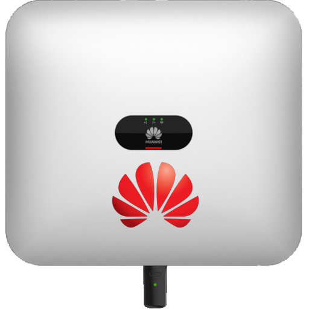

# ioBroker.sun2000

**Tests:** 

## sun2000 adapter for ioBroker

Read register data from Huawei SUN2000 inverter and LUNA2000 battery using Modbus TCP. 

Modbus interface definition (Issue 5, 2023-02-16):
https://forum.iobroker.net/assets/uploads/files/1699119419919-solar-inverter-modbus-interface-definitions-v5.pdf

The development of this adapter was inspired by discussions from the forum thread https://forum.iobroker.net/topic/53005/huawei-sun2000-iobroker-via-js-script-funktioniert and the iobroker javascript https://github.com/ChrisBCH/SunLuna2000_iobroker.

## Supported hardware

* HUAWEI Inverter (SUN2000 Serie) M1 
* HUAWEI Smart Dongle-WLAN-FE / min. Softwareversion: xxxSPC133 (SDongleA-05)
* HUAWEI Luna2000 Battery
* HUAWEI Smart Power Sensor DTSU666-H or DDSU666-H

## Configure inverters

In order to use the Modbus connection, all Huawei devices must use the latest firmware
feature. You can perform latest firmware directly in the FusionSolar portal under “Upgrades”.
In the FusionSolar setup you still have to activate the Modbus on the WLAN dongle and set the access authorization. Download the FusionSolar-App onto your cell phone and use it to connect via the inverter's WLAN hotspot directly.  
After the click on `Me` (Ich) in the footer Menu> `Commission Device` ("Inbetriebnahme des Geräts“) > `log in` (am Wechselrichter anmelden).

To log into the app as an `installer` you need usually the password:`00000a` or `0000000a` 
You may also need a password to connect to the inverters own WLAN: `Changeme` 

After login on the inverter go to `Settings` (Einstellungen) > `Communication configuration` (Kommunikationskonfiguration) > `Dongle parameter settings` (Dongle‐Parametereinstellungen) > `Modbus TCP` > Activate the `connection without restriction` (Verbindung uneingeschränkt aktivieren). You can also enter the Modbus comm address at the same time read out. 
If you use two inverters, then connect to the second inverter and read the communication address there too. A maximum of 2 inverters can be connected via Modbus. 

## Settings

* `address`: Inverter IP address
* `port`: Inverter modbus port (default: 502)
* `modbusId`: Primary Modbus inverter id (default: 1)
* `modbusId2`: Secondary Modbus inverter id (default: 0)
* `updateInterval`: Fast update interval (default: 30 sec)

## Changelog
<!--
	Placeholder for the next version (at the beginning of the line):
	### **WORK IN PROGRESS**
-->

### **WORK IN PROGRESS**
* (bolliy) Increase stability
* (bolliy) severeals states

### 0.0.3 (2024-01-01)
* watchdog implemented #11
* state values are cached - only changed data should be stored 
* derived and collected values for example `inputPowerEffective` or `inputYield`
* more states

### 0.0.2 (2023-12-19)
Dependency and configuration updates

### 0.0.1 
initial release

## License
MIT License

Copyright (c) 2023 bolliy <stephan@mante.info>

Permission is hereby granted, free of charge, to any person obtaining a copy
of this software and associated documentation files (the "Software"), to deal
in the Software without restriction, including without limitation the rights
to use, copy, modify, merge, publish, distribute, sublicense, and/or sell
copies of the Software, and to permit persons to whom the Software is
furnished to do so, subject to the following conditions:

The above copyright notice and this permission notice shall be included in all
copies or substantial portions of the Software.

THE SOFTWARE IS PROVIDED "AS IS", WITHOUT WARRANTY OF ANY KIND, EXPRESS OR
IMPLIED, INCLUDING BUT NOT LIMITED TO THE WARRANTIES OF MERCHANTABILITY,
FITNESS FOR A PARTICULAR PURPOSE AND NONINFRINGEMENT. IN NO EVENT SHALL THE
AUTHORS OR COPYRIGHT HOLDERS BE LIABLE FOR ANY CLAIM, DAMAGES OR OTHER
LIABILITY, WHETHER IN AN ACTION OF CONTRACT, TORT OR OTHERWISE, ARISING FROM,
OUT OF OR IN CONNECTION WITH THE SOFTWARE OR THE USE OR OTHER DEALINGS IN THE
SOFTWARE.