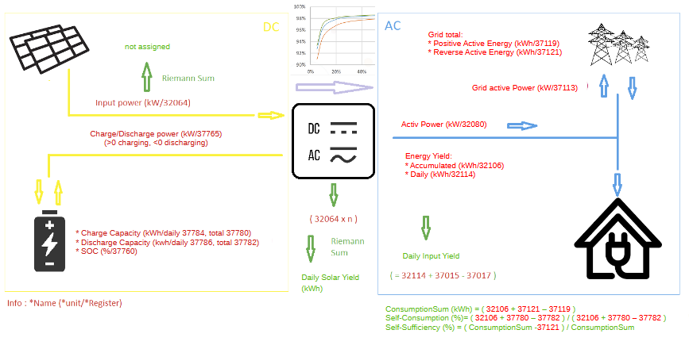

# Calculation

The calculation implemented are described by this diagram ([Source](https://github.com/ChrisBCH/SunLuna2000_iobroker/blob/main/HuaweiSunLuna2000.png)):

The following variables are used or can be calculated yourself:

- `Input power`: sun2000.0.collected.inputPower 
- `Charge/Discharge power`: sun2000.0.collected.chargeDischargePower
- `Charge capacity daily`: sun2000.0.collected.currentDayChargeCapacity
- `Charge capacity total`: sun2000.0.collected.totalCharge
- `Discharge capacity daily`: sun2000.0.inverter.0.battery.currentDayDischargeCapacity
- `Discharge capacity total`: sun2000.0.inverter.0.battery.totalDischarge
- `SOC`: sun2000.0.collected.SOC
- `Daily Solar yield`: sun2000.0.collected.dailySolarYield
- `Grid total, positive active Energy`: sun2000.0.meter.positiveActiveEnergy
- `Grid total, reverse active Energy`: sun2000.0.meter.reverseActiveEnergy
- `Grid active power`: sun2000.0.meter.activePower
- `active power`: sun2000.0.collected.activePower
- `Energy yield Accumulated`: sun2000.0.collected.accumulatedEnergyYield
- `Energy yield Daily`: sun2000.0.collected.dailyEnergyYield
- `Daily input yield`: sun2000.0.collected.dailyInputYield
- `CommsumptionSum`: sun2000.0.collected.consumptionSum
- `Self-consumption %`: (sun2000.0.collected.accumulatedEnergyYield+sun2000.0.collected.totalCharge-sun2000.0.inverter.0.battery.totalDischarge- sun2000.0.meter.positiveActiveEnergy) / (sun2000.0.collected.accumulatedEnergyYield + sun2000.0.collected.totalCharge - sun2000.0.inverter.0.battery.totalDischarge)
- `Self-Sufficiency %`: (sun2000.0.collected.consumptionSum - sun2000.0.meter.reverseActiveEnergy) / sun2000.0.collected.consumptionSum

