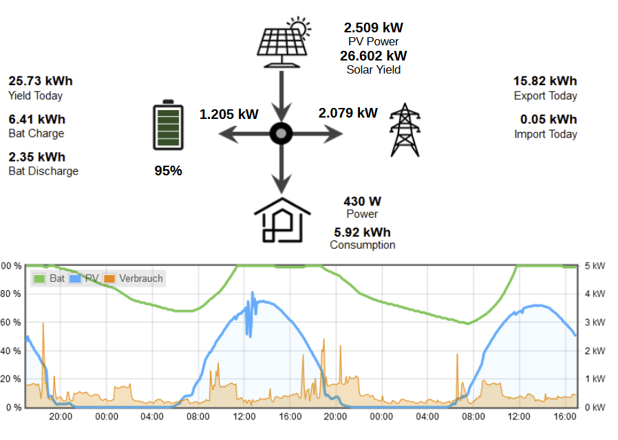

## Example Vis

The following picture shows an example Vis that shows the energy flow between the different components. In the lower part a flot diagram shows battery charge, power production and consumption during the last 48 hours

The following variables are used in the Vis display:

- Yield Today: sun2000.0.collected.dailyInputYield
- Bat Charge: sun2000.0.collected.currentDayChargeCapacity
- Bat Discharge: sun2000.0.collected.currentDayDischargeCapacity
- Battery Percent: sun2000.0.collected.SOC
- Solar panel, actual power : sun2000.0.collected.inputPower
- Solar panel, Solar Yield : sun2000.0.collected.dailySolarYield
- Power to and from battery : sun2000.0.collected.chargeDischargePower
- Power to and from grid: sun2000.0.meter.activePower
- Power consumption house: sun2000.0.collected.houseConsumption
- Daily power consumption of house: sun2000.0.collected.consumptionToday
- Power Export Today: sun2000.0.collected.gridExportToday
- Import Today: sun2000.0.collected.gridImportToday

The following additional variables are available for output: 

- Inverter Device Status: sun2000.0.inverter.0.derived.deviceStatus (e.g 'On-grid', 'Standby: detecting irradiation')
- Battery Working Mode: sun2000.0.inverter.0.battery.workingModeSettings (e.g. 2: 'Maximise Self Consumption')
- Battery Running Status: sun2000.0.inverter.0.battery.runningStatus (e.g. 'running', 'sleep mode')
- Inverter Temperature: sun2000.0.inverter.0.internalTemperature (temperature or '0' if in standby)
- Battery Unit Temperature: sun2000.0.inverter.0.battery.unit.1.batteryTemperature (temperature or '0' if in standby)
- Grid Frequency: sun2000.0.meter.gridFrequency 
